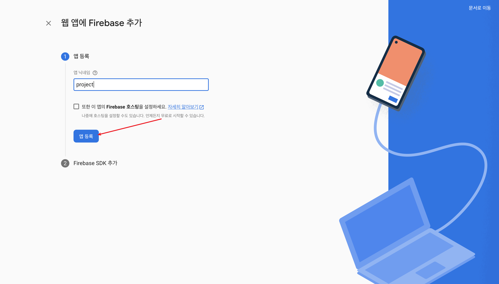

# Add Next.js project to Firebase Project

### 1. register web app

1-1) click </img>(web button)

1-2) 웹앱 프로젝트 이름 입력

1-3) 콘솔로 이동

- 모듈 sdk를 이용할 것이기 때문에 네모칸 안의 firebaseConfig 부분만 따로 복사해두면 된다

### 2. webapp registered

