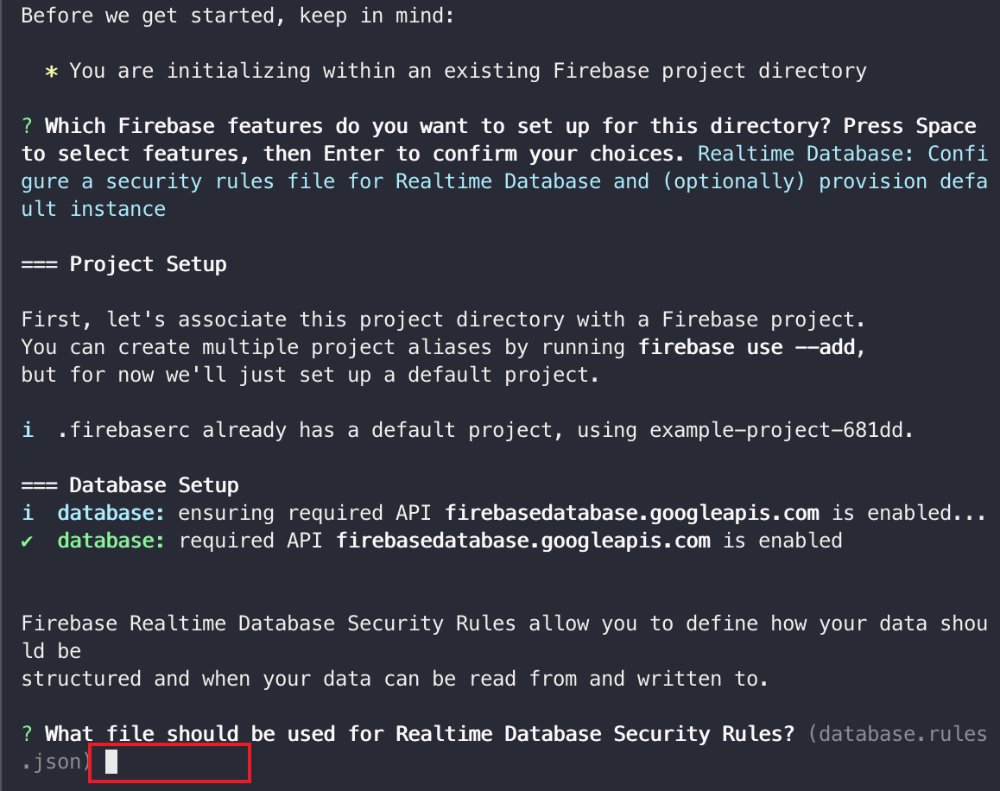

# Add Realtime Database to Next.js Project

### 1. init realtime database

1-1) realtime database setup

- 화살표로 Realtime Database로 이동해서 spacebar로 선택하고 enter를 누른다


- 데이터베이스 보안 규칙을 저장할 파일 이름 설정



1-2) firebase sdk 설치

```Shell
npm install --save firebase
```

### 2. firebase usage

- firebase 모듈을 import 해서 사용합니다

```javascript
import firebase from "firebase/app";
import "firebase/auth";
import "firebase/database";
```

- 다음 config 코드를 작성해 앱에서 firebase를 초기화합니다
(config 내용을 까먹었으면 [여기](find_firebase_app_config.md)를 참고하세요)

```javascript
var firebaseConfig = {
  apiKey: "API_KEY",
  authDomain: "PROJECT_ID.firebaseapp.com",
  databaseURL: "https://PROJECT_ID.firebaseio.com",
  projectId: "PROJECT_ID",
  storageBucket: "PROJECT_ID.appspot.com",
  messagingSenderId: "SENDER_ID",
  appId: "APP_ID",
  measurementId: "G-MEASUREMENT_ID",
};
```

- firebase database 사용

```javascript
// Get a reference to the database service
var database = firebase.database();

// Read
async function read(collection) {
    let result = null;
    await firebase.database().ref().child(collection).get().then((snapshot) => {
        if (snapshot.exists()) result = snapshot.val();
        else console.log("No data available");
    }).catch(error => console.error(error));

    return result;
}

// Write
function write(collection, data) {
  firebase.database().ref(collection).set(data);
}
```
example code
```javascript
write("sample/", {
  test: true
});

read("sample/");
```

참고링크: <https://firebase.google.com/docs/database/web/read-and-write?hl=ko>

참고자료: <https://blog.jarrodwatts.com/the-ultimate-guide-to-firebase-with-nextjs>
