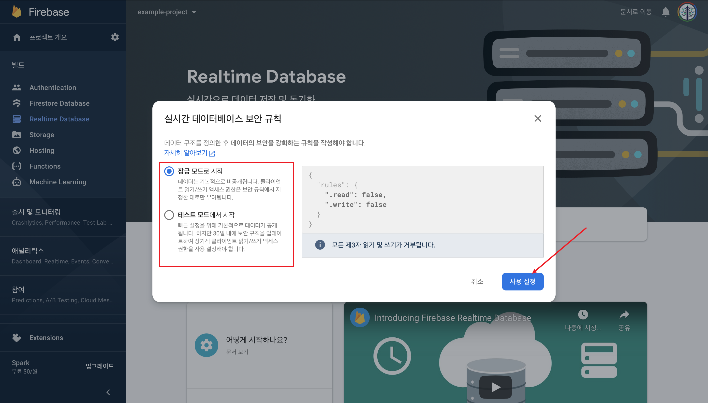
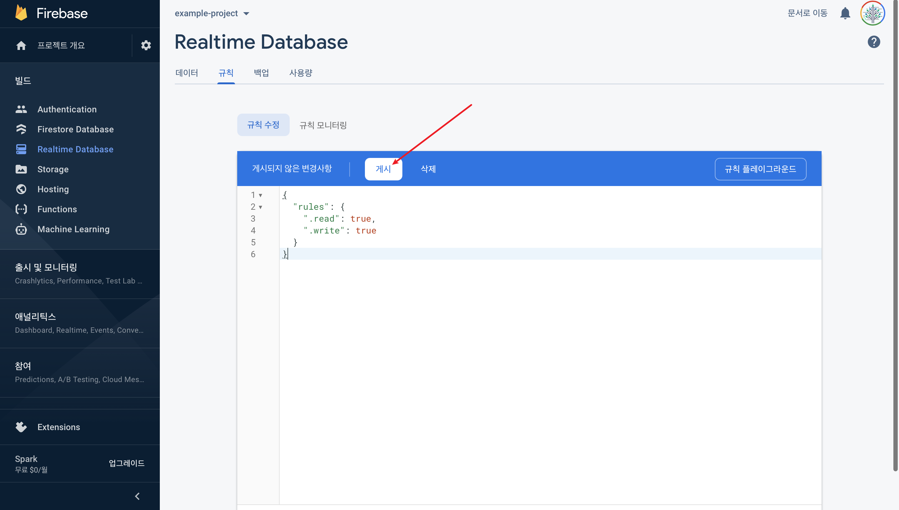

# Create Firebase Realtime Database

### 1. create realtime database

1-1) realtime database 시작

1-2) 보안 규칙

- [상세설명](https://firebase.google.com/docs/database/web/start?authuser=0#create_a_database)

### 2. realtime database created

### 3. set security rules

- 잠금 모드로 시작시 read, write가 모두 금지되어 있으므로 권한을 수정해줘야 한다

참고링크: https://css-tricks.com/intro-firebase-react/
