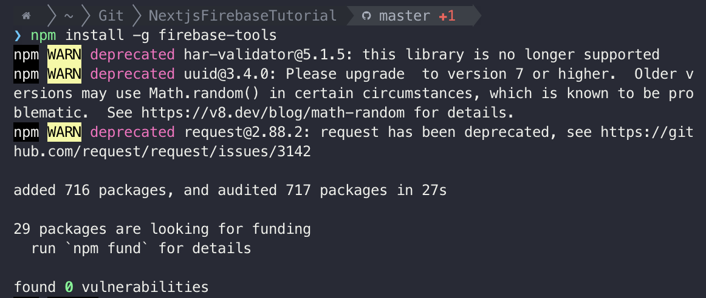
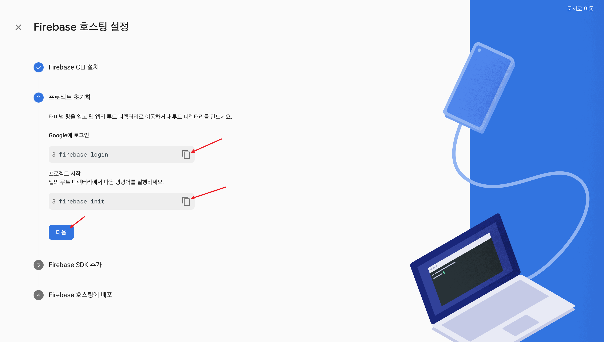
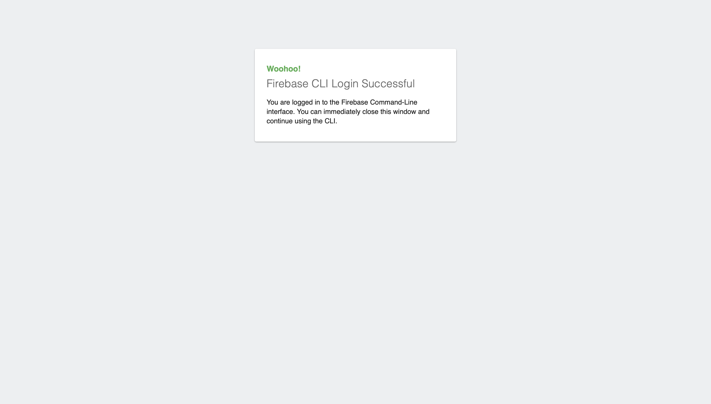
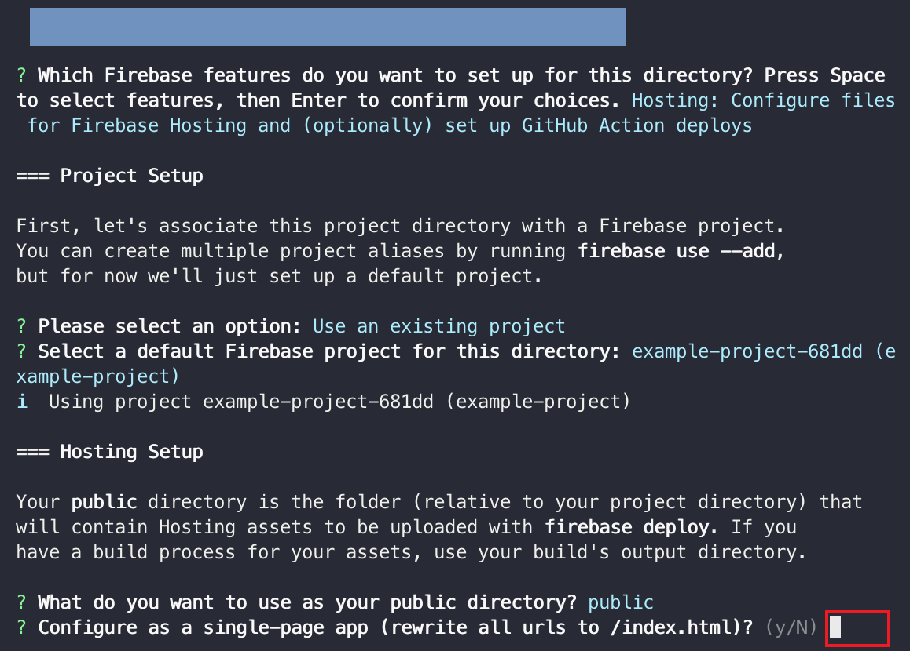
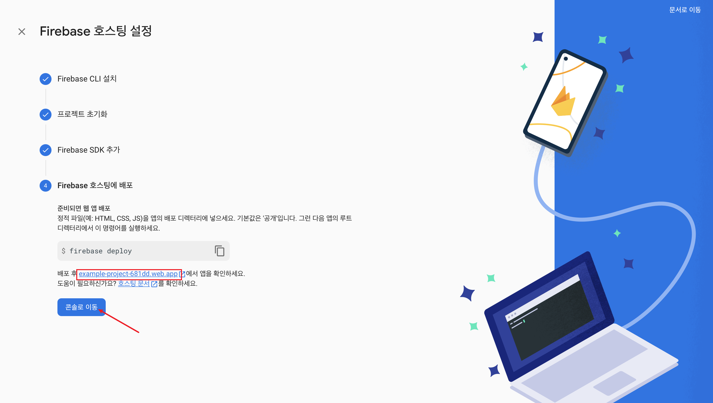
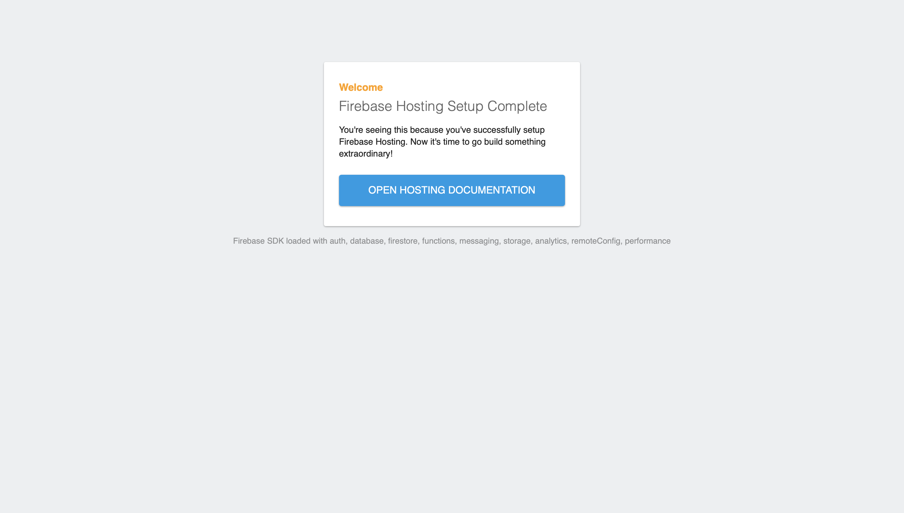

# Start Firebase Hosting

### 1. init firebase hosting

1-1) hosting 시작


1-2) firebase hosting 설정


1-3) firebase-tools 다운로드

```Shell
npm install -g firebase-tools
```



1-4) 프로젝트 초기화

- move to your project directory

```Shell
cd {project_directory}
```



1-5) firebase login

- to login

```Shell
firebase login
```

- to logout

```Shell
firebase logout
```




1-6) firebase  init

```Shell
firebase init
```

- 화살표로 Hosting으로 이동해서 spacebar로 선택하고 enter를 누른다


- 파이어베이스 프로젝트를 이미 생성했으므로 "Use an existing project"를 선택한다. 새로 생성하기를 원하는 경우에는 "Create a new project"를 선택하면 된다


- 이 호스팅에 사용할 파이어베이스 프로젝트를 선택한다


- 퍼블릭으로 사용할 폴더 이름을 지정한다


- 페이지가 하나인 앱인지 여러개인 앱인지 설정한다 (y/N)



- 깃과 자동으로 연동할 것인지 설정한다 (y/N)


1-7) firebase sdk 추가

- next js 프로젝트 이름을 입력한다

- sdk 추가의 경우 모듈형 sdk를 설치할 것이므로 넘어가면 된다


1-8) 배포 시에 해당 명령어를 사용하면 된다

```Shell
firebase deploy
```

- 배포된 프로젝트는 네모 칸 안의 링크를 통해 확인할 수 있다



- 아무런 작업 없이 배포하면 해당 화면을 확인할 수 있다



### 2. firebase hosting setting done


